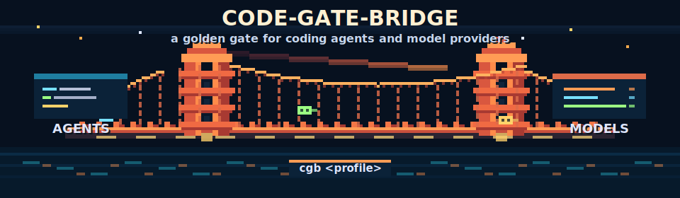

# Code Gate Bridge

<p align="center">
  
</p>

A local Anthropic-compatible proxy and profile manager for Claude Code. CGB is provider-agnostic: it lets Claude Code talk to custom upstream models through local, reversible, observable profiles.

## Status

MVP. The current transport targets providers that expose an OpenAI-compatible `/v1/chat/completions` API. Other custom-provider transports can be added behind the same profile/proxy shape.

## Prerequisites

- Node.js 20+
- npm
- Claude Code CLI available as `claude`
- A provider endpoint and API key, usually OpenAI-compatible Chat Completions

## Quick start with any OpenAI-compatible provider

```bash
git clone https://github.com/seilk/code-gate-bridge.git
cd code-gate-bridge
npm install -g .

cgb init
# Put CUSTOM_PROVIDER_API_KEY=*** in ~/.config/code-gate-bridge/secrets.env
cgb profile create my-provider-gpt-4.1 \
  --base-url https://api.example.com/v1 \
  --model gpt-4.1 \
  --key-env CUSTOM_PROVIDER_API_KEY \
  --format yaml \
  --visible-model claude-opus-4-7

cgb doctor my-provider-gpt-4.1
cgb route-test my-provider-gpt-4.1 --prompt 'Reply exactly CGB_ROUTE_OK'
cgb my-provider-gpt-4.1
```

`my-provider-gpt-4.1` is only an example profile name. Prefer profile names in the form `<provider>-<upstream-model>`, preserving provider-recognized model names when valid, for example `openrouter-gpt-4.1`, `gateway-gemini-3-flash-preview`, or `local-qwen3-coder`.

For multiple models on the same provider, create one profile per upstream model:

```bash
cgb profile create gateway-gpt-4.1 --base-url https://api.example.com/v1 --model gpt-4.1 --key-env CUSTOM_PROVIDER_API_KEY --format yaml
cgb profile create gateway-gemini-3-flash-preview --base-url https://api.example.com/v1 --model gemini-3-flash-preview --key-env CUSTOM_PROVIDER_API_KEY --format yaml

cgb gateway-gpt-4.1
cgb gateway-gemini-3-flash-preview
```

The direct `cgb <profile>` form is native CGB behavior, not a shell alias. Claude Code flags are forwarded as-is, so this works without a `--` separator:

```bash
cgb gateway-gpt-4.1 -p "hi" --max-turns 1
```

## Built-in provider presets

`cgb providers` lists optional presets that fill in known base URLs, key env names, and capability defaults. Presets are convenience only; CGB does not require a preset.

```bash
cgb providers
cgb profile create some-preset-model --provider <preset-id> --model <upstream-model> --format yaml
```

The generic path is always available:

```bash
cgb profile create <profile> --base-url <provider-v1-url> --model <upstream-model> --key-env <ENV_NAME>
```

## What this changes on your machine

Creates local user files only:

```text
~/.config/code-gate-bridge/secrets.env
~/.config/code-gate-bridge/profiles/*.json
~/.local/state/code-gate-bridge/state.json
~/.local/state/code-gate-bridge/events.jsonl
```

`cgb run` and `cgb <profile>` create a temporary Claude Code settings file for that process and point Claude Code at a local proxy. They do not require putting provider API keys in `~/.claude/settings.json`.

## Commands

```text
cgb init                    Create config and secrets file
cgb providers               List built-in provider presets
cgb profile create          Create a provider profile
cgb profile list            List profiles
cgb profile show            Show a profile with inline secrets redacted
cgb profile export          Export a profile as JSON or YAML
cgb profile import          Import a profile from JSON or YAML
cgb serve                   Start a local proxy for manual integration
cgb run                     Launch Claude Code through a profile
cgb <profile>               Launch a profile directly, forwarding Claude Code flags
cgb doctor                  Validate profile/config basics
cgb route-test              Send a real request through the local proxy
cgb status                  Show last observed proxy state
```

`cgb serve` hides the local bearer token by default. Use `--show-token` only for manual debugging.

## Managing profiles as JSON or YAML

Profiles are plain files under:

```text
~/.config/code-gate-bridge/profiles/
```

CGB reads either `.json`, `.yaml`, or `.yml` profiles. JSON is the default, but YAML is often nicer for hand-editing:

```bash
cgb profile create gateway-gpt-4.1 --base-url https://api.example.com/v1 --model gpt-4.1 --key-env CUSTOM_PROVIDER_API_KEY --format yaml
cgb profile show gateway-gpt-4.1 --format yaml
cgb profile export gateway-gpt-4.1 --format yaml --output gateway-gpt-4.1.yaml
cgb profile import gateway-gpt-4.1.yaml --name gateway-gpt-4.1-copy --format json
```

Example YAML profile:

```yaml
name: gateway-gpt-4.1
provider: openai-compatible
visible_model: claude-opus-4-7
client_model: opus
context_window: 200000
max_output_tokens: 8192
reasoning_effort: xhigh
upstream:
  type: openai-chat-completions
  base_url: https://api.example.com/v1
  model: gpt-4.1
  api_key_env: CUSTOM_PROVIDER_API_KEY
capabilities:
  streaming: true
  tools: true
  images: false
  thinking: false
  prompt_cache: false
retry:
  max_retries: 0
  base_delay_ms: 250
```

The built-in YAML reader intentionally supports a small safe subset: nested mappings and scalar strings/numbers/booleans/null. It rejects arrays, anchors, aliases, and flow-style YAML instead of guessing. Secrets should still live in `secrets.env`; `profile show` and `profile export` redact inline `api_key` values.

`reasoning_effort` is optional and becomes the default OpenAI-compatible `reasoning_effort` sent upstream. Claude Code's in-TUI `/effort` command still works under CGB and overrides this profile default per request. For Letsur `gpt-5.5`, use `low`, `medium`, `high`, or `xhigh`; Claude Code's `max` is translated to `xhigh` because Letsur rejects `reasoning_effort: max`.

`visible_model` is the model ID CGB returns in Anthropic-compatible responses. `client_model` is the Claude Code selector passed to the Claude Code CLI, normally `opus`, so Claude Code accepts the launch while CGB routes to the real upstream model.

## Claude Code display behavior

Claude Code owns the top welcome-box model/billing text. CGB does not try to rewrite that header. CGB's source of truth is the status line, which shows the real route, for example `CGB gateway-gpt-4.1 → gpt-4.1`.

`cgb run` passes only `ANTHROPIC_AUTH_TOKEN` for the local proxy token, not `ANTHROPIC_API_KEY`, to avoid Claude Code's custom API-key confirmation prompt.

To verify the interactive TUI path with tmux against any configured profile:

```bash
npm run test:tui -- <profile>
```

This launches a real Claude Code TUI in a temporary tmux session, checks that the CGB route statusline appears, sends a prompt, verifies the expected reply, writes the final capture to `/tmp`, and closes the tmux session.

## Supported MVP API subset

- `POST /v1/messages`
- `GET /v1/models`
- `HEAD /v1/messages` / `OPTIONS /v1/messages` compatibility probes
- text input/output
- non-streaming text
- basic streaming text, tested only for text deltas
- URL images in `tool_result` are redacted to placeholders

Not yet stable:

- image forwarding
- prompt caching
- extended thinking
- server tools
- fallback chains
- complete streaming tool-call deltas
- web dashboard

Unsupported features should fail loudly as the project matures. Current MVP is intentionally narrow.

## Security model

- Proxy binds to `127.0.0.1` by default.
- Local proxy requests require a bearer token.
- Local token uses cryptographic randomness.
- Upstream API keys live in `secrets.env` or process env, not in repo files.
- Logs are metadata-only and redacted.
- `profile show` redacts inline API keys.

## Troubleshooting

### Claude Code still seems to use the wrong provider

Run:

```bash
cgb route-test <profile>
cgb status
```

The `upstream_model` in state/logs is the real provider model. Claude Code may still display its client compatibility model.

### API key missing

Set the env var named by `--key-env` in either your shell or:

```text
~/.config/code-gate-bridge/secrets.env
```

### Statusline is blank or stale

If you wrap an existing statusline, set:

```bash
CGB_BASE_STATUSLINE_COMMAND='<your original statusline command>'
```

`cgb run` passes this through to its generated settings.

## Development

```bash
npm test
npm run lint
npm run test:tui -- <profile>   # optional live TUI test, requires tmux/claude/provider credentials
```
