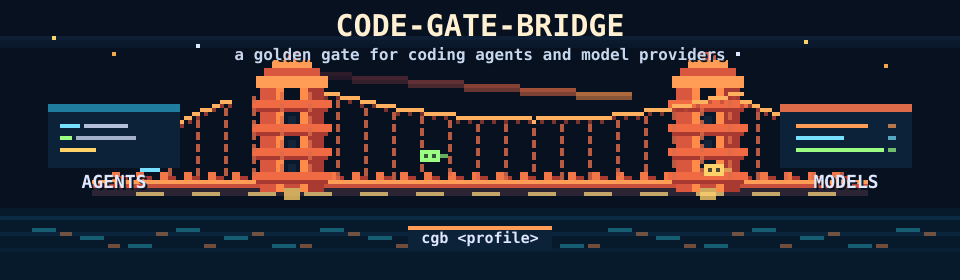

# Code Gate Bridge

<p align="center">
  
</p>

A local Anthropic-compatible proxy and profile manager for Claude Code. CGB is provider-agnostic: it lets Claude Code talk to custom upstream models through local, reversible, observable profiles.

## Status

MVP. The current transport targets providers that expose an OpenAI-compatible `/v1/chat/completions` API. Other custom-provider transports can be added behind the same profile/proxy shape.

## Prerequisites

- Node.js 20+
- npm
- Claude Code CLI available as `claude`
- A provider endpoint and API key, usually OpenAI-compatible Chat Completions

## Quick start with any OpenAI-compatible provider

```bash
git clone https://github.com/seilk/code-gate-bridge.git
cd code-gate-bridge
npm install -g .

cgb init
# Put CUSTOM_PROVIDER_API_KEY=*** in ~/.config/code-gate-bridge/secrets.env
cgb profile create my-provider-gpt-4.1 \
  --base-url https://api.example.com/v1 \
  --model gpt-4.1 \
  --key-env CUSTOM_PROVIDER_API_KEY \
  --format yaml \
  --visible-model claude-opus-4-7

cgb doctor my-provider-gpt-4.1
cgb route-test my-provider-gpt-4.1 --prompt 'Reply exactly CGB_ROUTE_OK'
cgb my-provider-gpt-4.1
```

`my-provider-gpt-4.1` is only an example profile name. Prefer profile names in the form `<provider>-<upstream-model>`, preserving provider-recognized model names when valid, for example `openrouter-gpt-4.1`, `gateway-gemini-3-flash-preview`, or `local-qwen3-coder`.

The `--base-url` value must be the provider's OpenAI-compatible API root, not just the provider's domain. CGB appends `/chat/completions` for the current transport. For example, use `https://api.example.com/v1` when the real upstream endpoint is `https://api.example.com/v1/chat/completions`.

For multiple models on the same provider, create one profile per upstream model:

```bash
cgb profile create gateway-gpt-4.1 --base-url https://api.example.com/v1 --model gpt-4.1 --key-env CUSTOM_PROVIDER_API_KEY --format yaml
cgb profile create gateway-gemini-3-flash-preview --base-url https://api.example.com/v1 --model gemini-3-flash-preview --key-env CUSTOM_PROVIDER_API_KEY --format yaml

cgb gateway-gpt-4.1
cgb gateway-gemini-3-flash-preview
```

The direct `cgb <profile>` form is native CGB behavior, not a shell alias. Claude Code flags are forwarded as-is, so this works without a `--` separator:

```bash
cgb gateway-gpt-4.1 -p "hi" --max-turns 1
```

## Built-in provider presets

`cgb providers` lists optional presets that fill in known base URLs, key env names, and capability defaults. Presets are convenience only; CGB does not require a preset.

```bash
cgb providers
cgb profile create some-preset-model --provider <preset-id> --model <upstream-model> --format yaml
```

The generic path is always available:

```bash
cgb profile create <profile> --base-url <provider-v1-url> --model <upstream-model> --key-env <ENV_NAME>
```

Presets are the safer path when available because they avoid subtle URL mistakes and fill in known credential names and capability defaults.

## Provider URLs and model limits

For OpenAI-compatible providers, `--base-url` should be the API root that contains `/chat/completions`, usually a URL ending in `/v1`. Do not use only the provider's public web domain unless that is also its API root.

```bash
cgb profile create gateway-large-context \
  --base-url https://api.example.com/v1 \
  --model provider-large-model \
  --key-env PROVIDER_API_KEY \
  --format yaml \
  --context-window 1000000
```

CGB will call `https://api.example.com/v1/chat/completions` for that profile. `context_window` controls Claude Code's generated `autoCompactWindow` setting and the statusline denominator. CGB does not currently discover model context limits from the provider at runtime, so set this per profile from the provider's model documentation when the default is wrong.

## What this changes on your machine

Creates local user files only:

```text
~/.config/code-gate-bridge/secrets.env
~/.config/code-gate-bridge/profiles/*.json
~/.local/state/code-gate-bridge/state.json
~/.local/state/code-gate-bridge/events.jsonl
~/.local/state/code-gate-bridge/proxy.json
~/.local/state/code-gate-bridge/managed-settings.json
```

`cgb run` and `cgb <profile>` create a temporary Claude Code settings file for that process and point Claude Code at a local proxy. They do not require putting provider API keys in `~/.claude/settings.json`.

Managed proxy mode keeps a local proxy URL, bearer token, and Claude Code settings file under CGB state so background or agent workflows can reconnect after the foreground TUI exits.

## Commands

```text
cgb init                    Create config and secrets file
cgb providers               List built-in provider presets
cgb profile create          Create a provider profile
cgb profile list            List profiles
cgb profile show            Show a profile with inline secrets redacted
cgb profile export          Export a profile as JSON or YAML
cgb profile import          Import a profile from JSON or YAML
cgb serve                   Start a local proxy for manual integration
cgb proxy start             Start a managed restartable local proxy
cgb proxy stop              Stop the managed proxy
cgb proxy restart           Restart the managed proxy on the same URL/token
cgb proxy status            Show managed proxy state
cgb run                     Launch Claude Code through a profile
cgb run --managed-proxy     Launch Claude Code through the managed proxy
cgb <profile>               Launch a profile directly, forwarding Claude Code flags
cgb agents                  Open Claude Code Agent View (forwards to `claude agents`)
                            `agents` is reserved; profiles named `agents` are shadowed.
                            Set `CGB_CLAUDE_BIN` to override the resolved claude binary.
cgb doctor                  Validate profile/config basics and computed upstream endpoint
cgb route-test              Send a real request through the local proxy
cgb status                  Show last observed proxy state
```

`cgb serve` hides the local bearer token by default. Use `--show-token` only for manual debugging.

## Managed proxy mode

The default `cgb run` path starts a local proxy for the lifetime of that launched Claude Code process. That is ideal for ordinary foreground sessions. For long-lived Claude Code Agent View or background jobs, use the managed proxy so retries can keep using the same local URL and token:

```bash
cgb proxy start <profile>
cgb proxy status
cgb run --managed-proxy <profile> agents
```

`cgb <profile> agents` and Claude Code `--bg` launches automatically use managed proxy mode. If the managed proxy process exits while a background job still exists, restart it:

```bash
cgb proxy restart
```

`restart` reuses the stored port and token from `proxy.json`, so clients that already have that local URL can reconnect. Use `cgb proxy stop` when you no longer want the managed proxy running. The token is stored in a `0600` state file and hidden from `status` output unless you pass `--show-token`.

## Managing profiles as JSON or YAML

Profiles are plain files under:

```text
~/.config/code-gate-bridge/profiles/
```

CGB reads either `.json`, `.yaml`, or `.yml` profiles. JSON is the default, but YAML is often nicer for hand-editing:

```bash
cgb profile create gateway-gpt-4.1 --base-url https://api.example.com/v1 --model gpt-4.1 --key-env CUSTOM_PROVIDER_API_KEY --format yaml
cgb profile show gateway-gpt-4.1 --format yaml
cgb profile export gateway-gpt-4.1 --format yaml --output gateway-gpt-4.1.yaml
cgb profile import gateway-gpt-4.1.yaml --name gateway-gpt-4.1-copy --format json
```

Example YAML profile:

```yaml
name: gateway-gpt-4.1
provider: openai-compatible
visible_model: claude-opus-4-7
client_model: opus
context_window: 200000
max_output_tokens: 8192
reasoning_effort: xhigh
upstream:
  type: openai-chat-completions
  base_url: https://api.example.com/v1
  model: gpt-4.1
  api_key_env: CUSTOM_PROVIDER_API_KEY
capabilities:
  streaming: true
  tools: true
  images: false
  thinking: false
  prompt_cache: false
retry:
  max_retries: 0
  base_delay_ms: 250
```

The built-in YAML reader intentionally supports a small safe subset: nested mappings and scalar strings/numbers/booleans/null. It rejects arrays, anchors, aliases, and flow-style YAML instead of guessing. Secrets should still live in `secrets.env`; `profile show` and `profile export` redact inline `api_key` values.

`context_window` is the context limit CGB tells Claude Code to use for auto-compaction and statusline display. It should match the effective upstream model window for that profile. If the statusline shows an unexpected limit such as `200k`, update the profile with `--context-window <tokens>` and restart the CGB-launched Claude Code session.

`reasoning_effort` is optional and becomes the default OpenAI-compatible `reasoning_effort` sent upstream. Claude Code's in-TUI `/effort` command still works under CGB and overrides this profile default per request. Use values supported by your upstream provider; CGB translates Claude Code's `max` effort to `xhigh` for OpenAI-compatible requests.

`visible_model` is the model ID CGB returns in Anthropic-compatible responses. `client_model` is the Claude Code selector passed to the Claude Code CLI, normally `opus`, so Claude Code accepts the launch while CGB routes to the real upstream model.

## Claude Code display behavior

Claude Code owns the top welcome-box model/billing text. CGB does not try to rewrite that header. CGB's source of truth is the status line, which shows the real route, for example `CGB gateway-gpt-4.1 → gpt-4.1`.

`cgb run` passes only `ANTHROPIC_AUTH_TOKEN` for the local proxy token, not `ANTHROPIC_API_KEY`, to avoid Claude Code's custom API-key confirmation prompt.

To verify the interactive TUI path with tmux against any configured profile:

```bash
npm run test:tui -- <profile>
```

This launches a real Claude Code TUI in a temporary tmux session, checks that the CGB route statusline appears, sends a prompt, verifies the expected reply, writes the final capture to `/tmp`, and closes the tmux session.

## Supported MVP API subset

- `POST /v1/messages`
- `GET /v1/models`
- `HEAD /v1/messages` / `OPTIONS /v1/messages` compatibility probes
- text input/output
- non-streaming text
- basic streaming text, tested only for text deltas
- URL images in `tool_result` are redacted to placeholders

Not yet stable:

- image forwarding
- prompt caching
- extended thinking
- server tools
- fallback chains
- complete streaming tool-call deltas
- web dashboard

Unsupported features should fail loudly as the project matures. Current MVP is intentionally narrow.

## Security model

- Proxy binds to `127.0.0.1` by default.
- Local proxy requests require a bearer token.
- Local token uses cryptographic randomness.
- Upstream API keys live in `secrets.env` or process env, not in repo files.
- Logs are metadata-only and redacted.
- `profile show` redacts inline API keys.

## Troubleshooting

### Claude Code still seems to use the wrong provider

Run:

```bash
cgb route-test <profile>
cgb status
```

The `upstream_model` in state/logs is the real provider model. Claude Code may still display its client compatibility model.

### Route test returns 404 from upstream

Check the upstream endpoint that `cgb doctor` reports:

```bash
cgb doctor <profile>
```

For OpenAI-compatible profiles, CGB sends requests to:

```text
<base_url>/chat/completions
```

If your provider documents `/v1/chat/completions`, the profile `base_url` must include `/v1`. If the profile omits that path prefix, CGB may call the wrong endpoint and the provider can return `404 Not Found`. Prefer a built-in preset when one exists for your provider.

### Statusline shows the wrong context limit

Inspect the profile:

```bash
cgb profile show <profile> --format yaml
```

The `context_window` field is the limit CGB passes to Claude Code. To fix it, recreate or edit the profile with the correct token count from your provider's model documentation, then start a new CGB session:

```bash
cgb profile create <profile> --base-url <provider-v1-url> --model <upstream-model> --key-env <ENV_NAME> --format yaml --context-window <tokens>
cgb <profile>
```

### Background job reports ConnectionRefused

If a Claude Code background job points at a local CGB URL whose proxy has exited, it can report:

```text
API Error: Unable to connect to API (ConnectionRefused)
```

Check the managed proxy state:

```bash
cgb proxy status
```

If the job was launched with managed proxy mode, restart the proxy on the same local URL/token:

```bash
cgb proxy restart
```

If the job was launched with the default temporary proxy, the old local token was not persisted. Start a fresh CGB session or relaunch the job with managed proxy mode.

### API key missing

Set the env var named by `--key-env` in either your shell or:

```text
~/.config/code-gate-bridge/secrets.env
```

### Statusline is blank or stale

If you wrap an existing statusline, set:

```bash
CGB_BASE_STATUSLINE_COMMAND='<your original statusline command>'
```

`cgb run` passes this through to its generated settings.

## Development

```bash
npm test
npm run lint
npm run test:tui -- <profile>   # optional live TUI test, requires tmux/claude/provider credentials
```
